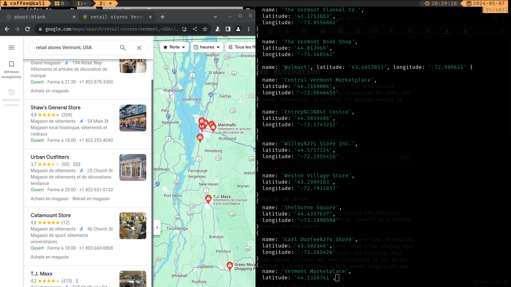

# Google Maps Scraper

# Project Description

The Google Maps Scraper project is designed to extract valuable information about retail businesses listed on Google Maps. This tool aims to automate the process of data collection, providing users with a comprehensive dataset that can be used for various purposes such as market research, competitor analysis, and customer targeting.

## Installation

```shell

    npm install

```

## Run

```
    npm start

```

## output

```
[
    {
        name:string,
        Latitude:number,
        Longitude:number
    }
]


```


## Tools

language: typescript
Tools: [Puppeteer](https://pptr.dev/), [Puppeteer-extra](https://www.npmjs.com/package/puppeteer-extra), [Puppeteer-extra-stealth-plugin](https://www.npmjs.com/package/puppeteer-extra-plugin-stealth)
